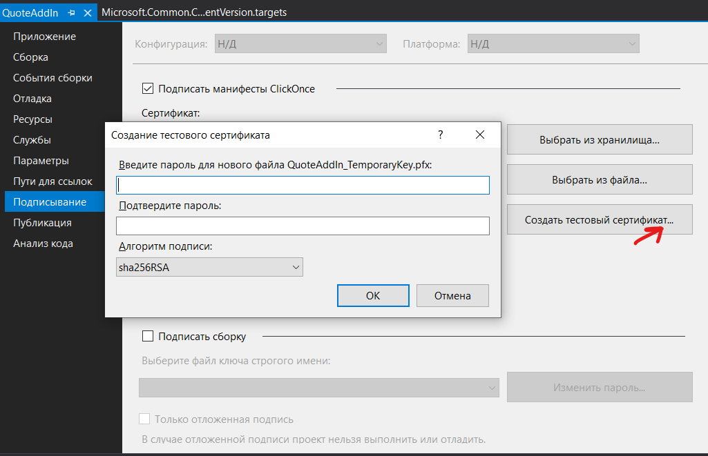

# OutlookAddIn
Небольшой плагин для Outlook с возможностью цитирования сообщений

# Использование
После компиляции плагина он автоматически попадёт в перечень используемых расширений Outlook.

# Компиляция
Перед построением необходимо сгенерировать автосертификат посредством Visual Studio:

